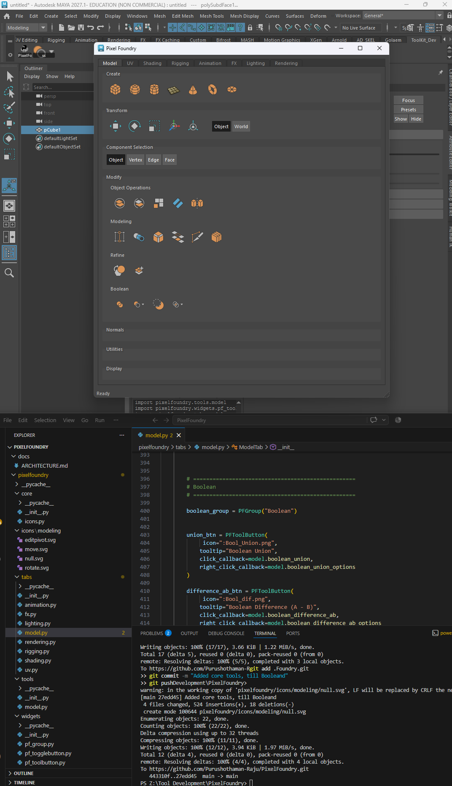

# Pixel Foundry 

# Pixel Foundry

**Production Toolkit for Autodesk Maya**

*Currently under development — Release forthcoming.*

Pixel Foundry is a custom **floating and dockable Maya workspace** designed to make Maya easier to approach, learn, and work with without overwhelming the user.

Rather than presenting Maya as a vast collection of independent commands, Pixel Foundry organizes tools into a **structured, workflow-driven environment**. The aim is to give new users a clear path through Maya — allowing them to progressively explore its tools and concepts while building an understanding of how the software works.

A beginner can start with the fundamentals, follow the workflow step by step, and gradually discover different aspects of Maya without being confronted by the full complexity of the application at once.

At the same time, intermediate and advanced users can use Pixel Foundry as a **focused production toolbox**, with frequently used functionality organized into a consistent and accessible workspace.

### Core Approach

**Learn → Explore → Work**

Pixel Foundry is being developed around the idea that a tool should not simply perform an operation — its organization should also help users understand **where that operation fits within a larger workflow**.

The initial workflow focuses on modeling fundamentals, progressing through areas such as:

* Creating primitives
* Object transformation
* Component selection
* Modeling operations
* Refinement
* Boolean operations
* Normals and display
* UV and other workflow areas as development progresses

The workspace is intended to grow beyond modeling into a broader **structured Maya environment**, introducing users to different aspects of Maya through progressively organized workflows.

### Design Goals

* **Approachable** — Reduce the intimidation of Maya's extensive interface and toolset.
* **Guided** — Provide a logical progression for users learning Maya.
* **Structured** — Organize functionality around workflows rather than an arbitrary collection of commands.
* **Discoverable** — Help users encounter Maya features naturally as they progress.
* **Production-focused** — Give experienced users a clean, organized toolbox for frequently used operations.
* **Modular** — Allow different areas of Maya to be developed as independent tool groups.
* **Extensible** — Provide a foundation for expanding the workspace with additional tools and workflows.

### Current Development Target

* Floating / dockable Maya workspace
* Modern Qt6-based UI
* Modular and extensible architecture
* Structured modeling workflow
* Beginner-friendly learning path
* Production-oriented tool organization
* Progressive expansion into other Maya workflows

### Development Status

Pixel Foundry is **actively under development**.

The current build represents the foundation of the workspace and its underlying tool architecture. Features, workflows, UI structure, and organization are still being refined and expanded.

**Version 1 is not yet released.**

The project is being developed toward a future public release as a structured Maya workspace and production toolkit.

